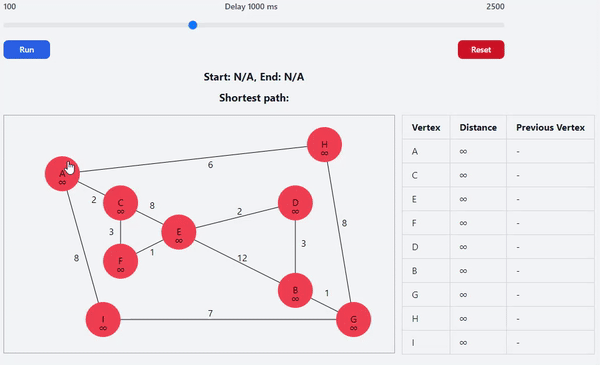

# Dijkstras Algoritme Visualisering



## Beskrivelse
Dette projekt visualiserer Dijkstras Algoritme, som bruges til at finde den korteste vej mellem noder i en graf. Visualiseringen hjælper brugere med at forstå, hvordan algoritmen arbejder trin-for-trin.

### For Almindelige Mennesker
Dijkstras Algoritme er en metode, der bruges til at finde den korteste rute fra et punkt til et andet. Denne applikation giver en visuel repræsentation af, hvordan algoritmen beregner disse ruter.

## Link til Deployet Applikation
[Se den deployede applikation her](https://dijkstra.fhallengreen.com/)

## Sådan Kører Du Lokalt
For at køre visualiseringen lokalt, følg disse trin:

1. . Klon Repo:
   ```
   git clone https://github.com/FHallengreen/Dijkstra-algo.git
   ```
2. Åben det i VS Code.
3. Tryk på "Go Live" i bunden til højre. (Vær sikker på du har Live Server extension installeret)
4. Visualiseringen vil åbne i din standard browser.
